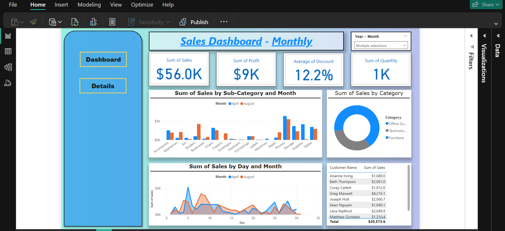

<h1 align="center">Sales Dashboard - Monthly</h1>

  This Power BI dashboard provides a comprehensive overview of monthly sales performance, allowing users to analyze key metrics and trends.

  

<h2>Overview</h2>

  The dashboard is designed to provide quick insights into sales data, focusing on key performance indicators (KPIs) and visualizations that highlight important trends. It includes interactive elements for filtering and drilling down into specific data points.

<h2>Key Features</h2>

<ul>
  <li><strong>Key Metrics at a Glance:</strong> Displays essential KPIs such as Sum of Sales, Sum of Profit, Average of Discount, and Sum of Quantity.</li>
  <li><strong>Year - Month Filter:</strong> Allows users to select specific months and years for focused analysis.</li>
  <li><strong>Sum of Sales by Sub-Category and Month:</strong> Bar chart comparing sales across different sub-categories for selected months.</li>
  <li><strong>Sum of Sales by Category:</strong> Pie chart showing the distribution of sales across different categories.</li>
  <li><strong>Sum of Sales by Day and Month:</strong> Line chart illustrating daily sales trends for the selected months.</li>
  <li><strong>Customer-Level Sales Data:</strong> Table displaying customer names and their corresponding sales amounts.</li>
</ul>

<h2>Visualizations</h2>

<ul>
  <li><strong>KPI Cards:</strong> Display the Sum of Sales, Sum of Profit, Average of Discount, and Sum of Quantity.</li>
  <li><strong>Bar Chart:</strong> Shows the Sum of Sales by Sub-Category and Month.</li>
  <li><strong>Donut Chart:</strong> Represents the Sum of Sales by Category.</li>
  <li><strong>Line Chart:</strong> Visualizes the Sum of Sales by Day and Month.</li>
  <li><strong>Table:</strong> Lists Customer Names and their Sum of Sales.</li>
</ul>

<h2>How to Use</h2>

<ol>
  <li><strong>Select a Month and Year:</strong> Use the "Year - Month" filter to focus on specific time periods.</li>
  <li><strong>Analyze Key Metrics:</strong> Review the KPI cards for a quick overview of performance.</li>
  <li><strong>Explore Sub-Category and Category Sales:</strong> Use the bar and pie charts to understand sales distribution across different categories and sub-categories.</li>
  <li><strong>Track Daily Sales Trends:</strong> Utilize the line chart to identify daily fluctuations and trends.</li>
  <li><strong>Review Customer Sales Data:</strong> Refer to the table for customer-specific sales information.</li>
</ol>

<h2>Potential Improvements</h2>

<ul>
  <li><strong>Clearer Labels:</strong> Improve the clarity of labels for better understanding.</li>
  <li><strong>Consistent Color Scheme:</strong> Implement a consistent color scheme across all charts.</li>
  <li><strong>Interactive Tooltips:</strong> Add tooltips for more detailed information on data points.</li>
  <li><strong>Profit Margin Analysis:</strong> Include profit margin calculations or visualizations.</li>
  <li><strong>Trendlines:</strong> Add trendlines to the line chart for clearer trend analysis.</li>
  <li><strong>KPI Targets:</strong> Incorporate sales targets for performance comparison.</li>
  <li><strong>Contextual Information:</strong> Add titles and explanations to each chart.</li>
  <li><strong>Mobile Responsiveness:</strong> Ensure the dashboard is responsive for mobile viewing.</li>
</ul>

<h2>Muhammad Daniyal</h2>

 
